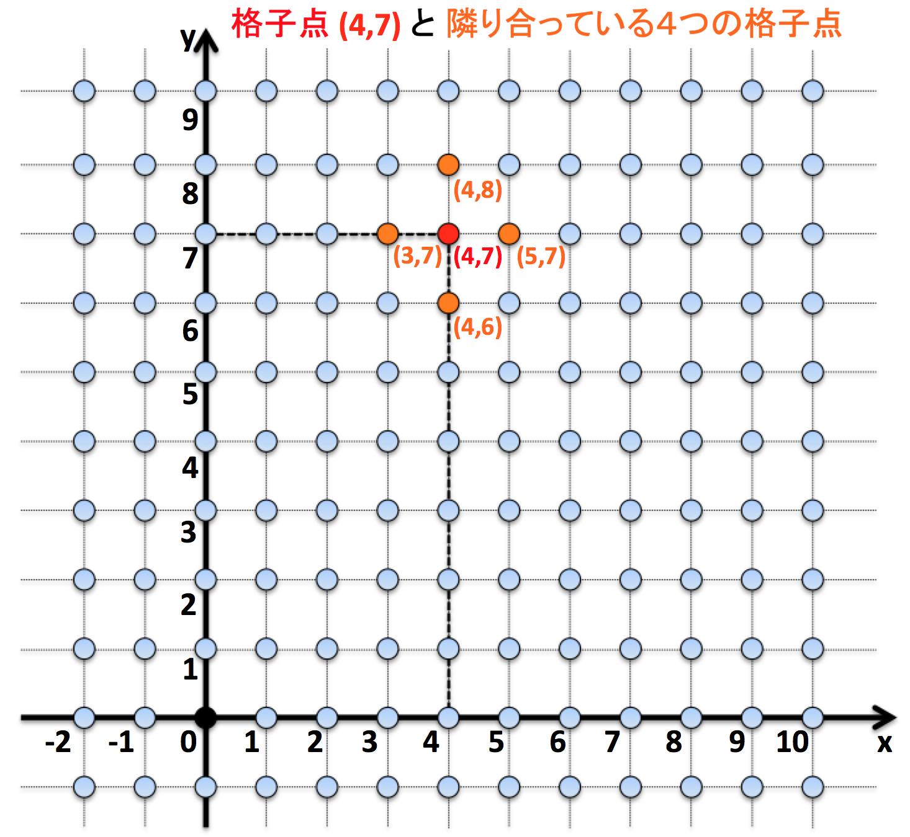

# TDDBC ペアプロデモ

## デモのお題について

### 平面座標上の格子点 (grid point)

座標平面上にある点で
- x座標 (x-coordinate)
- y座標 (y-coordinate)

がともに整数である点を格子点と呼ぶ

- [X] DONE x座標とy座標を与えて格子点を生成できる

- [X] DONE 生成した格子点から文字列表記 (notation) が取得できる

  (例) x座標が4、y座標が7である格子点の文字列表記は (4,7) である

- [X] DONE ２つの格子点が同じ座標 (coordinates) を持つか判定できる

- [X] DONE ２つの格子点が 隣り合っている (neighbor) かを判定できる

   ただし、格子点 (x,y)は、４つの格子点
   - (x-1,y)
   - (x+1,y)
   - (x,y-1)
   - (x,y+1)

   と隣り合っているものとする

- [X] DONE 右上の格子点 (5,8) と左下の格子点 (3,6) が隣り合っていないかを判定できる

## ライセンス
Apache License, Version 2.0です (詳しくはプロジェクト直下の LICENSE-2.0.txt をご覧ください)
